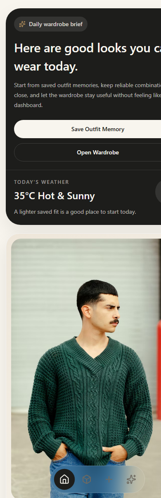
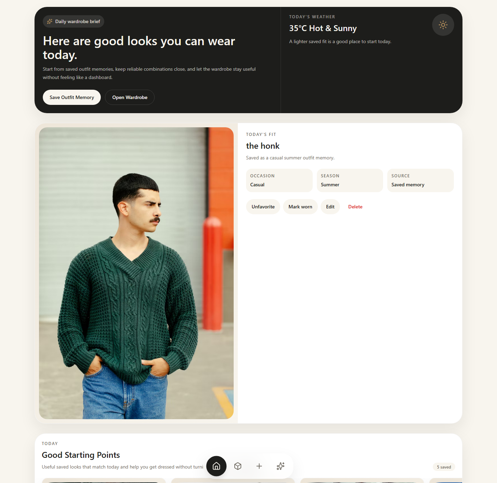
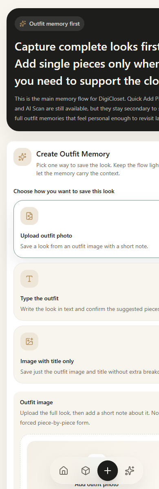
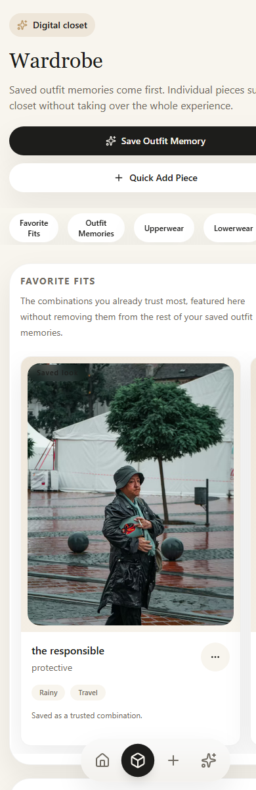
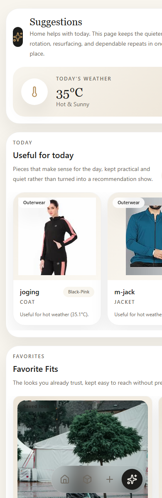
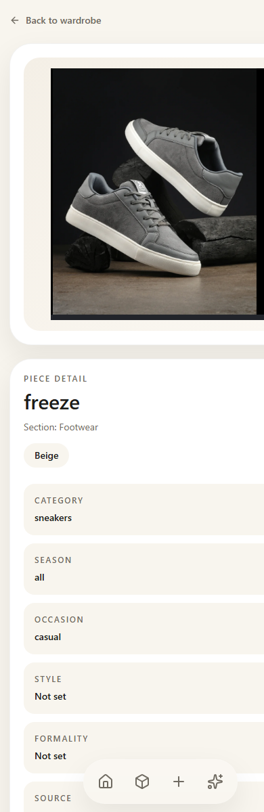

# DigiCloset

DigiCloset is a mobile-first, outfit-memory-first wardrobe application.

It is built to help people save complete looks, organize wardrobe pieces around those looks, and resurface combinations they already trust. The product is intentionally not a clothing inventory dashboard, e-commerce store, social feed, or fake-AI fashion wrapper.

## Current Product State

DigiCloset currently includes:

- adaptive Home experience focused on daily outfit usefulness
- outfit-memory-first capture flow
- wardrobe browsing with outfit rails and clothing-piece sections
- frontend authentication flow
  - welcome screen
  - login
  - signup
  - protected routes
  - session persistence
  - logout
- dedicated outfit detail pages
- piece detail pages
- searchable category entry for clothing and outfit-piece flows
- shared wardrobe taxonomy for Indian, western, and Indo-western categories
- autosuggest/chip metadata inputs for:
  - color
  - season
  - occasion
  - style
  - formality
- existing-piece search inside the outfit builder so saved wardrobe pieces can be reused before new duplicates are created
- calm wardrobe filters and sorting for faster closet browsing without leaving the outfit-memory-first product shape
- refreshed protected-app shell with:
  - warmer editorial app canvas
  - quieter identity/profile header
  - sculpted bottom dock
- refreshed Home into:
  - a warmer editorial welcome
  - a stronger outfit-led hero
  - calmer weather support
  - softer memory rails
- corrected Home again so it stays closer to the mobile editorial reference:
  - smaller top rhythm
  - more dominant hero image
  - more compact image-led rails
  - less landing-page feel on desktop
- refreshed Wardrobe toward a calmer closet-browsing layout with:
  - softer editorial search and filter controls
  - stronger closet-zone section panels
  - earlier saved outfit memories
  - less empty dashboard-like stretch
- corrected Wardrobe again so it stays closer to the reference:
  - compressed filter area
  - removed duplicate chip clutter
  - fixed chip overlap/clipping
  - kept category panels more prominent than controls
- corrected Wardrobe once more so filters stay behind a compact button:
  - visible search bar
  - compact `Filter` button with active count
  - compact sort control
  - no always-expanded filter wall
- shared client-side wardrobe data layer for outfits and clothing
- outfit lifecycle actions:
  - favorite / unfavorite
  - mark worn
  - edit metadata
  - delete
- deterministic suggestions and rediscovery
- mobile-first layout and bottom dock navigation
- image upload support for outfits and pieces
- shared 10 MB upload validation across frontend and backend
- backend-safe image/delete persistence with local upload cleanup
- backend auth foundation:
  - users model
  - signup
  - login
  - current-user endpoint
- backend user ownership filtering:
  - outfits scoped by `user_id`
  - clothing items scoped by `user_id`
  - suggestions scoped per authenticated user
  - default dev-user backfill for existing local data
- authenticated frontend session wiring:
  - bearer token storage in localStorage
  - Authorization header attachment
  - auth-aware wardrobe fetch gating
  - protected route redirects

## Product Philosophy

DigiCloset follows a strict hierarchy:

1. Outfit experiences
2. Outfit memories
3. Wardrobe visualization
4. Clothing pieces as supporting structure
5. Suggestions as lightweight, explainable rediscovery

The app should feel:

- premium
- calm
- visually organized
- personal
- style-aware
- mobile-first

The app should not feel like:

- an admin dashboard
- a spreadsheet
- a raw clothing inventory tool
- a fake AI chatbot

## Main App Areas

### Home

Home is now adaptive instead of fixed.

Depending on how much wardrobe data exists, it can show:

- an editorial wardrobe return moment
- Today's Fit only when an outfit was actually saved that day
- deterministic starting looks from real closet pieces
- Good Starting Points
- Favorite Fits
- Seasonal Staples
- Quiet Rediscovery only when enough real wear history exists

Home is designed to answer:

> What can I wear today?

The current visual direction also pushes Home toward:

- one stronger outfit-led hero moment
- compact weather support instead of a dashboard-style module
- calmer image-led rails for memory and favorites
- warmer editorial spacing instead of stacked utility boxes
- a centered app-screen feeling on desktop instead of a wide web landing layout

Important Home rule:

- if you saved an outfit today, that real saved look becomes `Today’s Fit`
- if you did not save an outfit today, DigiCloset does not force a fake “today” card
- in that case, recommendations and starting points lead the page instead

### Outfit Memory

This is the primary creation flow.

Users can save a complete look through:

- outfit photo upload
- text-guided outfit capture
- image with title only

Inside the text-guided builder, DigiCloset now also supports:

- searching existing wardrobe pieces
- selecting reusable existing pieces into the pending outfit
- mixing reused existing pieces with newly created manual pieces

Secondary tools exist, but remain clearly secondary:

- Quick Add Piece
- AI Scan Piece

### Wardrobe

Wardrobe behaves like a digital closet:

- calm search across outfits, pieces, colors, categories, and occasions
- lightweight chip filters for:
  - content
  - section
  - season
- compact sorting for:
  - Recently added
  - Recently worn
  - Favorites first
  - A-Z
- Favorite Fits
- All Outfit Memories
- Western upperwear
- Western lowerwear
- One-piece / Full body
- Footwear
- Outerwear
- Indian upperwear
- Indian lowerwear
- Indian full outfit
- Drapes
- Accessories
- Base layers
- Activewear
- Other

Wardrobe search is now normalization-aware, so searches like:

- `off white`
- `monsoon`
- `smart casual`
- `indo western`
- `wedding`

can still find normalized stored values without needing raw underscore strings.

Favorites are featured, not moved. A favorited outfit still remains in the full outfit memory rail.

The current Wardrobe visual direction also pushes the page toward:

- a calmer centered editorial intro
- softer integrated search, chip, and sort controls
- stronger category sections that feel like closet zones instead of admin groupings
- saved outfit memories staying visible near the top as wardrobe anchors
- a mobile-app feel on desktop instead of a wide utility page
- compressed controls that support browsing without becoming the page
- filter options hidden behind a compact control instead of always occupying the page

### Outfit Detail

Each saved look now has a dedicated detail route:

- large outfit image or memory placeholder
- calm metadata context
- favorite / mark worn / edit / delete actions
- grouped piece breakdown
- links from outfit pieces into piece detail pages

This is where an outfit becomes a remembered look instead of only a rail card.

### Suggestions

Suggestions is the quieter resurfacing page, not a second Home.

It can surface:

- Useful for today
- Favorite Fits
- Recently Worn
- Seasonal Rotation
- Quiet Rediscovery
- Most Reused Pieces

These sections are deterministic and based on real data only.

### Piece Detail

Each clothing piece has a dedicated detail page:

- image or placeholder
- normalized category and section
- color
- season
- occasion
- style
- formality
- source
- related outfit memories

## Routes

- `/welcome` -> Welcome
- `/login` -> Login
- `/signup` -> Signup
- `/` -> Home
- `/outfit-memory` -> Outfit Memory
- `/wardrobe` -> Wardrobe
- `/suggestions` -> Suggestions
- `/outfits/:id` -> Outfit Detail
- `/pieces/:id` -> Piece Detail

Legacy redirects:

- `/capture` -> `/outfit-memory`
- `/vault` -> `/wardrobe`

## Tech Stack

### Frontend

- React
- Vite
- React Router
- Tailwind CSS
- Lucide React
- route-level lazy loading
- `AuthContext` for user + session state
- shared `WardrobeDataProvider` for outfit and clothing state
- shared wardrobe taxonomy helpers for category normalization, grouping, and labels
- shared wardrobe taxonomy helpers for:
  - category normalization
  - category grouping
  - metadata normalization for color / season / occasion / style / formality
  - readable display labels
- browser verification script for critical shared-state flows

### Backend

- FastAPI
- SQLAlchemy
- Pydantic
- SQLite for local development
- safe local upload cleanup for outfit and clothing images
- backend auth foundation with:
  - password hashing
  - bearer token creation/verification
  - `POST /api/auth/signup`
  - `POST /api/auth/login`
  - `GET /api/auth/me`
- backend ownership filtering with:
- protected outfit routes
- protected clothing routes
- protected suggestions route
- default local dev user migration support
  - frontend-compatible dev auth testing support

## Current Phase Roadmap

Recent auth and ownership phases:

- `3E.1` backend auth foundation
- `3E.2` backend user ownership migration and filtering
- `3E.2.1` dev-user password reset utility
- `3E.3` frontend auth context, login/signup, protected routes, and bearer-token wiring
- `3E.3B` auth reference-matched visual redesign
- `3E.3C` auth screen correction into separate mobile-style welcome/login/signup screens
- `3E.4` user-scoped uploads polish and full auth/app QA

Recent wardrobe-information phase:

- `3F.1` searchable category picker + Indian/western wardrobe taxonomy
- `3F.2` wardrobe search + lightweight filtering
- `3F.3` field autosuggest + chip inputs for wardrobe metadata cleanup
- `3F.4` existing-piece search inside the outfit builder to encourage wardrobe reuse over duplicate clothing records
- `3F.5` calm wardrobe filters + sorting

Next planned wardrobe-information phase:

- `3F.6` small metadata-filter refinement such as occasion-aware narrowing, only if it keeps Wardrobe calm and mobile-first

Current visual refresh roadmap:

- `3G.0` visual reference interpretation + app theme rules
- `3G.1` AppShell + bottom dock visual refresh
- `3G.2` Home visual refresh
- `3G.3` Wardrobe visual refresh
- `3G.4` Outfit Memory / Capture visual refresh
- `3G.5` Suggestions visual refresh
- `3G.6` Outfit Detail + Piece Detail visual refresh
- `3G.7` final mobile visual QA

Completed visual refresh phases:

- `3G.0` visual reference system + app theme rules
- `3G.1` AppShell + bottom dock visual refresh
- `3G.2` Home visual refresh
- `3G.2B` Home correction toward the reference structure
- `3G.3` Wardrobe visual refresh
- `3G.3B` Wardrobe correction toward the reference structure
- `3G.3C` Wardrobe filter button + compact filter sheet correction

## Repository Structure

```text
client/
  src/
    components/
    context/
    pages/
    services/
    utils/
server/
  app/
    api/routes/
    core/
    db/
    models/
    schemas/
    services/
    utils/
docs/
  screenshots/
scripts/
```

## Screenshots

### Home





### Outfit Memory



### Wardrobe



### Suggestions



### Piece Detail



## Local Setup

### Backend

```powershell
cd D:\projects\digicloset\server
python -m venv venv
venv\Scripts\activate
pip install -r requirements.txt
copy .env.example .env
python -m uvicorn app.main:app --host 127.0.0.1 --port 8000 --reload
```

### Frontend

```powershell
cd D:\projects\digicloset\client
npm install
npm.cmd run dev -- --host 127.0.0.1 --port 5173
```

Open:

```text
http://127.0.0.1:5173
```

## Build / Verification

### Frontend production build

```powershell
cd D:\projects\digicloset\client
npm.cmd run build
```

### Backend compile sanity check

```powershell
cd D:\projects\digicloset
python -m compileall server\app
```

### Backend auth verification

```powershell
curl.exe -X POST http://127.0.0.1:8000/api/auth/signup ^
  -H "Content-Type: application/json" ^
  -d "{\"email\":\"test@example.com\",\"password\":\"password123\",\"display_name\":\"Test User\"}"
```

```powershell
curl.exe -X POST http://127.0.0.1:8000/api/auth/login ^
  -H "Content-Type: application/json" ^
  -d "{\"email\":\"test@example.com\",\"password\":\"password123\"}"
```

### Ownership migration / backfill

```powershell
cd D:\projects\digicloset\server
.\venv\Scripts\python.exe ..\scripts\migrate_user_ownership.py
```

### Dev user password reset

```powershell
cd D:\projects\digicloset\server
.\venv\Scripts\python.exe ..\scripts\reset_dev_user_password.py
```

Local development login after reset:

- email: `dev@digicloset.local`
- password: `devpassword123`

### Frontend auth flow

Open the app:

```text
http://127.0.0.1:5173
```

Expected auth behavior now:

- unauthenticated visits to protected routes redirect to `/welcome`
- `/welcome` acts as the first-entry auth screen
- successful login restores access to:
  - Home
  - Outfit Memory
  - Wardrobe
  - Suggestions
  - Outfit Detail
  - Piece Detail
- refresh keeps the session active when the token is still valid
- logout clears the session and wardrobe state
- signup is reachable from both:
  - `/welcome`
  - `/login`

### Shared state browser verification

```powershell
cd D:\projects\digicloset\client
node .\scripts\verify-shared-data-layer.mjs
```

### Orphaned upload audit

```powershell
cd D:\projects\digicloset
python scripts\check-orphaned-uploads.py
```

This audit now scans both:

- old top-level local uploads
- nested user-scoped folders such as `uploads/u_{user_id}/...`

## Upload Rules

Current upload policy:

- max image size: 10 MB
- allowed formats:
  - jpg
  - jpeg
  - png
  - webp
- validation exists in both frontend and backend
- base64 image persistence is not used
- local uploaded files are deleted safely when a persisted outfit/piece image is removed or the owning record is deleted
- new authenticated uploads can be stored under user-scoped local folders like `uploads/u_{user_id}/...`
- old pre-user-scope upload URLs remain compatible

Oversize message:

> Image is too large. Please upload an image under 10 MB.

## Current Strengths

- coherent outfit-memory-first structure
- calmer, less dashboard-like UX
- better mobile layout behavior
- stronger daily-use Home logic
- consistent outfit lifecycle actions
- real piece detail flow
- deterministic, explainable suggestions
- faster cross-page outfit and piece mutations through shared client state
- real Outfit Detail flow for saved looks
- safer backend persistence for delete and image-removal flows
- local upload cleanup utilities and orphaned-upload auditing
- real backend user ownership boundaries for outfits, clothing items, and suggestions
- working frontend auth flow for protected wardrobe APIs
- private user-scoped wardrobe loading after login
- separate mobile-style auth entry screens that match the calmer DigiCloset editorial mood more closely
- verified user-scoped upload isolation across authenticated users
- verified logout/login switching without stale wardrobe leakage
- stronger mixed-wardrobe category support with readable labels and safer grouping
- better support for Indian traditional, western, and Indo-western clothing types
- fast frontend Wardrobe search without leaving the closet-style layout behind
- cleaner metadata entry through normalized autosuggest and chip inputs
- more readable color / season / occasion / style labels across the app
- easier reuse of existing wardrobe pieces while building a new outfit memory
- lightweight filtering and sorting that narrow the closet without turning it into inventory software
- a calmer, more outfit-memory-first Home that better matches the editorial visual system
- a corrected Home layout that now stays closer to the generated mobile reference instead of drifting toward a desktop landing page
- a calmer Wardrobe layout that now feels more like a private digital closet than a utility-heavy management page
- a corrected Wardrobe control area that now stays compact and avoids chip overlap or duplicate filter clutter
- a compact Wardrobe filter-button flow that lets content appear much sooner without losing filtering power

## Honest Current Gaps

The biggest remaining product-quality gap is now hosted-readiness planning plus deeper wardrobe discovery beyond the new search baseline:

- core outfit and piece mutations now use shared client state
- but weather/suggestion-derived content is still fetched separately from the shared wardrobe layer
- some secondary derived sections could still feel fresher after mutations
- old orphaned upload files from earlier bugs can now be detected, but are not auto-deleted by default
- local dev access to the backfilled dev user now has a dedicated reset utility for safe frontend-auth testing
- signup is now visually present and reachable, but the auth entry flow could still use one more tiny spacing pass if we later want even tighter parity with the reference image
- taxonomy, metadata entry, search, and basic filtering are now much stronger, but Wardrobe still does not yet have deeper metadata-aware narrowing like occasion refinement
- outfit creation now encourages reuse first, but it still does not surface broader duplicate-similarity suggestions beyond the current lightweight search/select flow

The highest-impact next refinement would be:

- Phase `3G.4`: Outfit Memory / Capture visual refresh, now that the shell, Home, and Wardrobe are aligned more closely with the editorial mobile visual system

## Documentation Maintenance

When the product changes meaningfully, update:

- `README.md` for current behavior
- `CHANGELOG.md` for release history
- `docs/screenshots/` for UI screenshots

Checkpoint discipline:

- after each completed phase, update the relevant markdown docs first
- then create a local git commit
- then push that checkpoint to the GitHub repo
- avoid leaving stale `pending checkpoint` notes behind in the changelog

To refresh screenshots with headless Edge:

```powershell
New-Item -ItemType Directory -Force -Path docs\screenshots | Out-Null

& 'C:\Program Files (x86)\Microsoft\Edge\Application\msedge.exe' `
  --headless --disable-gpu --hide-scrollbars `
  --window-size=390,1200 --virtual-time-budget=5000 `
  --screenshot='D:\projects\digicloset\docs\screenshots\home-mobile.png' `
  'http://127.0.0.1:5173/'
```

Repeat the same pattern for:

- `/outfit-memory`
- `/wardrobe`
- `/suggestions`
- `/pieces/:id`

## Changelog

Release history lives in [CHANGELOG.md](CHANGELOG.md).

Visual refresh planning and reference rules live in [docs/VISUAL_SYSTEM.md](docs/VISUAL_SYSTEM.md).

